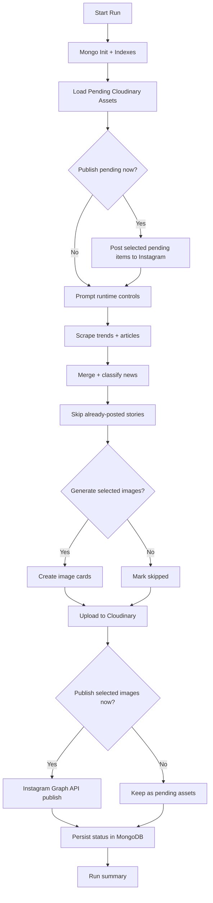
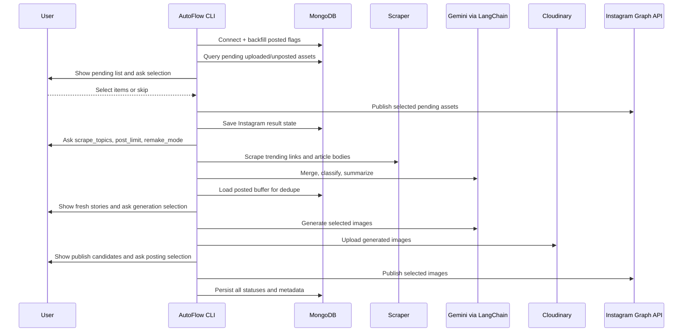

<p align="center">
  
</p>


<h1 align="center">AutoFlow.Studio</h1>

**AutoFlow** is an AI-powered content automation pipeline that turns fast-moving education and recruitment news into ready-to-publish social media assets. It is built for consistency, scale, and human-controlled publishing.

Instagram page: **https://www.instagram.com/auto.flowstudio/**

---

## Abstract

Students and job-seekers rely on scattered, noisy updates from dozens of websites. Important notifications get buried, duplicate stories repeat across channels, and manual social posting takes too much effort to sustain every day.

AutoFlow addresses this gap with a structured pipeline: scrape relevant trends, merge and deduplicate news, generate branded visual cards, upload media assets, and publish to Instagram with explicit user approval at key checkpoints.

This is not a one-click spam bot. It is an editorial automation system: fast machine execution with a clear human decision layer.

---

## The Problem We Are Solving

| Problem | Real-world impact |
|---|---|
| News is fragmented across many portals | Students miss deadlines, results, and notices |
| Same news appears with different wording | Duplicate posts reduce trust and engagement |
| Manual design + posting is slow | Teams cannot maintain consistent daily output |
| No structured memory of posted content | Reposting mistakes happen frequently |
| Publishing is often fully automatic or fully manual | Either too risky or too slow |

AutoFlow solves this by combining **intelligent filtering**, **persistent state in MongoDB**, and **human-in-the-loop publishing control**.

---

## What We Built (Current State)

AutoFlow currently provides:

- Google Trends-based scraping using Playwright (education/jobs context).
- AI merging and classification into clear categories.
- Duplicate prevention using title similarity, source matching, and manual keyword buffers.
- Dark-gradient social card generation via Gemini image model.
- Cloudinary upload and secure URL tracking.
- Instagram publish via Meta Graph API.
- Startup queue to publish previously uploaded-but-unposted assets first.
- Interactive CLI controls for scrape count, generation selection, and post selection.

---

## Product Journey: How We Thought, and How It Is Moving Forward

We started from a direct question: *“Can one pipeline reliably go from trend discovery to a public post?”*

Phase by phase, the system matured:

1. **Collection first**: make scraping stable and category-focused.
2. **Quality second**: merge duplicates and improve clarity of titles/summaries.
3. **Media layer**: generate standardized card assets with controlled visual consistency.
4. **Delivery layer**: move from local files to cloud-hosted assets and Instagram publishing.
5. **Reliability layer**: add Mongo persistence, dedupe memory, pending publish queue, and status tracking.
6. **Control layer**: add user confirmations and numbered selections before generation/posting.

The project now behaves like an automation backbone, not a script.

---

## High-Level Pipeline



---

## Detailed Runtime Control Flow



---

## Layered Architecture

| Layer | Responsibility | Main implementation |
|---|---|---|
| Interface Layer | User prompts and confirmations | CLI prompts in `main.py` |
| Orchestration Layer | Directed workflow and node execution | `langgraph` state graph in `main.py` |
| Intelligence Layer | Merge/classify/summarize + image generation | `langchain_google_genai` in `main.py` |
| Acquisition Layer | Trends + article scraping | Playwright scraper in `scraper.py` |
| Media Layer | Local image save and style strategy | image helper functions in `main.py` |
| Delivery Layer | Cloudinary upload + IG post | Cloudinary + Graph API helpers in `main.py` |
| Persistence Layer | State, status, dedupe memory | `MongoStore` in `mongo_store.py` |

---

## Repository Structure

| File | Purpose |
|---|---|
| `main.py` | Main pipeline, prompts, LangGraph nodes, upload/publish logic |
| `scraper.py` | Playwright-based scraper for trends and article body extraction |
| `mongo_store.py` | MongoDB data access layer, indexes, status updates |
| `publish_pending_instagram.py` | Utility script for posting pending assets |
| `.env.example` | Runtime configuration template |
| `requirements.txt` | Python dependencies |
| `explanation.md` | Design notes and implementation explanation |

---

## Data Model (MongoDB)

### `raw_news`
| Field | Meaning |
|---|---|
| `dedup_hash` | unique key from heading/source |
| `source_url` | source link |
| `heading` | raw headline |
| `content` | raw extracted article text |
| `run_id` | pipeline run identifier |
| `scraped_at`, `updated_at` | timestamps |

### `merged_news`
| Field | Meaning |
|---|---|
| `merge_hash` | unique key from category/title |
| `category` | normalized category label |
| `canonical_title` | merged final title |
| `merged_content` | final summary body |
| `source_links` | clustered source links |
| `status` | stage status (`MERGED`, `POSTED`, etc.) |

### `assets`
| Field | Meaning |
|---|---|
| `asset_hash` | unique key from category/title |
| `local_path` | generated image file path |
| `cloudinary_url/public_id` | cloud-hosted media reference |
| `instagram_creation_id/media_id/permalink` | IG publish metadata |
| `instagram_posted` | boolean flag for pending filtering |
| `status` | upload/publish lifecycle state |

---

## Distinctive Design Choices

1. **Dual dedupe strategy**: exact source overlap + title similarity + manual keyword memory.
2. **Pending-first startup**: old uploaded assets are surfaced before new scraping starts.
3. **Human checkpointing**: generation and publish are both selection-driven.
4. **Statusful automation**: every stage writes lifecycle state to MongoDB.
5. **Remake mode support**: intentionally regenerate/repost when needed.

---

## ✅ Pros

- High operational clarity due to explicit statuses and prompts.
- Strong control over accidental reposts.
- Easy to scale by adding more categories/sources.
- Can run daily with low manual overhead.
- Storage + delivery separation (local -> Cloudinary -> Instagram) improves recovery options.

## ⚠️ Cons
- Dependent on third-party APIs (Gemini, Cloudinary, Instagram, Trends page structure).
- Caption/content quality still depends on source quality.
- Requires careful credential hygiene.

---

## Ups and Downs So Far

| Area | What went well | What was difficult | Current mitigation |
|---|---|---|---|
| Scraping | Stable trend-to-article capture | Dynamic pages and occasional low-quality links | Domain blocking + per-topic link limits |
| AI merge | Good canonical title formation | Category drift in noisy data | strict category prompt + post-filtering |
| Image pipeline | Consistent social-card format | model quota errors | runtime toggles + selective generation |
| Publishing | Graph API integration works | token expiry / invalid tokens | long-lived token workflow + debug paths |
| Persistence | Strong run memory | schema evolution conflicts | indexes + backfill + explicit flags |

---

## Tech Stack

| Segment | Technology |
|---|---|
| Language | Python 3.11 |
| Workflow Orchestration | LangGraph |
| LLM Integration | LangChain + Google Gemini |
| Scraping | Playwright (Chromium) |
| Database | MongoDB |
| Media Hosting | Cloudinary |
| Social Publishing | Instagram Graph API |
| Config | `.env` via `python-dotenv` |

---

## Quick Start

### 1) Environment setup

```bash
pyenv local 3.11.14
python -m venv .venv
source .venv/bin/activate
pip install -r requirements.txt
cp .env.example .env
```

### 2) Configure `.env`
Fill at least:

- `GOOGLE_API_KEY`
- `MONGODB_URI`, `MONGODB_DB_NAME`
- `CLOUDINARY_CLOUD_NAME`, `CLOUDINARY_API_KEY`, `CLOUDINARY_API_SECRET`
- `INSTAGRAM_ACCESS_TOKEN`, `INSTAGRAM_IG_USER_ID`

Optional runtime controls:

- `SCRAPER_HEADLESS` (`false` to see Chromium UI)
- `DEFAULT_SCRAPE_TOPICS`
- `DEFAULT_POST_LIMIT`
- `PENDING_PUBLISH_SCAN_LIMIT`
- `DEDUPE_EXTRA_POSTED_TITLES`
- `DEDUPE_EXTRA_POSTED_KEYWORDS`

### 3) Run

```bash
python main.py
```

---

## Why This Is Different

Most automation tools stop at “generate and post.” AutoFlow is different because it treats publishing as a governed pipeline:

- It remembers what happened before.
- It asks before high-impact actions.
- It exposes pending assets at startup.
- It keeps a full content lifecycle in one place.

That makes it practical for teams, not just personal experiments.

---

## Target Community and Use Cases

### Primary community

- Students preparing for exams and admissions.
- Job-seekers tracking recruitment notifications.
- Education-focused creators and update channels.

### Teams that benefit most

- EdTech media teams.
- Exam preparation platforms.
- Scholarship/admissions advisory communities.
- Regional education news publishers.
- Recruitment information pages and aggregators.

### Firm profiles likely to gain immediate ROI

| Firm type | Why AutoFlow helps |
|---|---|
| Coaching networks | Faster notice/result updates across many channels |
| EdTech startups | Lower content ops cost for daily social output |
| Career-information platforms | Structured post workflow with dedupe memory |
| Niche education media pages | Improves consistency without increasing team size |

---

## Upcoming Best Features (Roadmap)

1. Multi-platform publishing (Telegram, LinkedIn, X, YouTube community).
2. Scheduled queue with calendar-based publishing windows.
3. Topic-level performance analytics and feedback loop.
4. Team roles and approval workflows (operator/editor/publisher).
5. Moderation safeguards (content policy + sensitive topic filters).
6. Retrieval layer for historical “similar notices” linking.
7. Hybrid template engine (brand packs, locale packs, bilingual cards).
8. API-first mode for agencies managing multiple client pages.

---

## Pricing and Access

AutoFlow is **free to use currently** in its present codebase form.
Operational costs are usage-dependent and come from external services:
- LLM API usage
- Cloudinary storage/transformations
- Instagram platform constraints
- MongoDB hosting tier

---

## Final Note

AutoFlow began as an automation idea and is steadily becoming a reliable publishing system. The goal is not only speed, but trust: accurate updates, controlled execution, and sustainable daily operation.

If you want to build education-first social infrastructure with discipline, this pipeline is a strong base.
